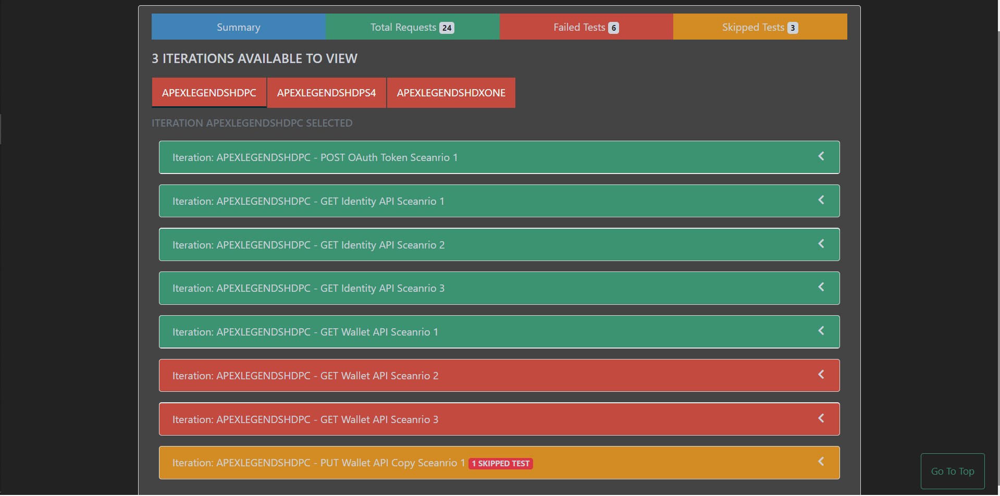

# newman-reporter-htmlextra-extended


[](https://github.com/sandeepkumar-aitha/newman-reporter-htmlextra-extended/actions)
[](https://www.npmjs.com/package/newman-reporter-htmlextra-extended)
[](https://www.npmjs.com/package/newman-reporter-htmlextra-extended)
[](https://www.npmjs.com/package/newman-reporter-htmlextra-extended)
[](https://hub.docker.com/r/dannydainton/htmlextra-extended)

This is forked from [Newman Reporter htmlextra](https://github.com/DannyDainton/newman-reporter-htmlextra). This package have 3 more extra features
1. Changed color for skipped cases from bg-success to bg-warning and changed badge color to badge-danger.
2. Introduced iteration names, By default existing report shows numbers but if we have multiple iteration and report user can't differentiate difference.
3. Introduced Scenario Numbering, If consecutive request names are same then "Scenario <number>" will be appendeding at the end. As of now implemented in "Total Requests" tab.

A [Newman](https://github.com/postmanlabs/newman) HTML reporter that has been extended to include the separation of the iteration runs so these are no longer aggregated together and also some additional `handlebars helpers` to enable users to create better custom templates. 

This reporter comes with a dashboard style summary landing page and a set of different tabs which contain the detailed request information. There are also a few optional configuration flags available, to tailor the final report in a number of different ways.

---

If you're a fan of the project and you wanted to show your appreciation by keeping me highly caffeinated - You can do that here 😍

<a href="https://www.buymeacoffee.com/htmlextra"></a>

---

## Report Example




---

## Interactive Example Report

To give you an idea of what the final report will look like, I've added a working example here for you to get your hands on:

- [Standard Report Showing All Successful Requests](https://s3.eu-west-2.amazonaws.com/newman-htmlextra-reports/All_Passed.html)

---

## Install

> The reporter works as a plugin with [Newman](https://github.com/postmanlabs/newman) so ensure that you have already installed that package globally, using `npm install -g newman`.

To `globally` install the `htmlextra` package:

```console
npm install -g newman-reporter-htmlextra-extended
```

To use `htmlextra` as a library, install the package as a dependency into a `nodejs` project's `package.json` file using:

```console
npm install -S newman-reporter-htmlextra-extended
```

To install `node`, `newman` and the `htmlextra` packages together, use this command to pull the `Docker` image:

```console
docker pull dannydainton/htmlextra
```

---

## Usage

In order to enable this reporter, specify `htmlextra-extended` in Newman's `-r` or `--reporters` option. The following command will create a new report in the `./newman` directory, if the directory does not exist, it will be created as part of the Newman run.

```console
newman run collection.json -r htmlextra-extended-extended
```

### CLI Options

#### With Newman CLI

| CLI Option  | Description       | Example |
|-------------|-------------------|---------|
| `--reporter-export <path>` | Specify a path where the output HTML file will be written to disk. If not specified, the file will be written to `newman/` in the current working directory. | `newman run collection.json -r htmlextra-extended --reporter-export ./results/report.html`|
| `--reporter-template <path>` | Specify a path to the custom template which will be used to render the HTML report. This option depends on `--reporter htmlextra` and `--reporter-export` being present in the run command. If this option is not specified, the [default template](./lib/dashboard-template.hbs) is used | `newman run collection.json -r htmlextra-extended --reporter-template ./template.hbs`|
| `--reporter-showOnlyFails` | Use this optional flag to tell the reporter to display only the requests with failed tests. | `newman run collection.json -r htmlextra-extended --reporter-showOnlyFails`|
| `--reporter-testPaging` | Use this optional flag to add pagination to the tests in the request view. | `newman run collection.json -r htmlextra-extended --reporter-testPaging`|
| `--reporter-browserTitle` | Use this optional flag to change the name of the title in the browser tab. The default name is "Newman Summary Report". | `newman run collection.json -r htmlextra-extended --reporter-browserTitle "My Newman report"`|
| `--reporter-title` | This optional flag can be used to give your report a different main `Title` in the centre of the report. If this is not set, the report will show "Newman Run Dashboard". | `newman run collection.json -r htmlextra-extended --reporter-title "My Newman Report"`|
| `--reporter-titleSize` | An optional flag to reduce the size of the main report title. The sizes range from `1` to `6`, the higher the number, the smaller the title will be. The default size is `2`. | `newman run collection.json -r htmlextra-extended --reporter-titleSize 4`|
| `--reporter-logs` | This optional flag shows any console log statements in the collection, on the final report. This is `false` by default. | `newman run collection.json -r htmlextra-extended --reporter-logs`|
| `--reporter-omitRequestBodies` | An optional flag which allows you to exclude all `Request Bodies` from the final report | `newman run collection.json -r htmlextra-extended --reporter-omitRequestBodies`|
| `--reporter-omitResponseBodies` | An optional flag which allows you to exclude all `Response Bodies` from the final report | `newman run collection.json -r htmlextra-extended --reporter-omitResponseBodies`|
| `--reporter-hideRequestBody` | An optional flag which allows you to exclude certain `Request Bodies` from the final report. Enter the name of the request that you wish to hide. | `newman run collection.json -r htmlextra-extended --reporter-hideRequestBody "Login"`|
| `--reporter-hideResponseBody` | An optional flag which allows you to exclude certain `Response Bodies` from the final report. Enter the name of the request that you wish to hide. | `newman run collection.json -r htmlextra-extended --reporter-hideResponseBody "Auth Request"`|
| `--reporter-showEnvironmentData` | An optional flag which allows you to show all the `Environment` variables used during the run, in the final report | `newman run collection.json -r htmlextra-extended --reporter-showEnvironmentData`|
| `--reporter-skipEnvironmentVars` | An optional flag which allows you to exclude certain `Environment` variables from the final report | `newman run collection.json -r htmlextra-extended --reporter-skipEnvironmentVars "API_KEY"`|
| `--reporter-showGlobalData` | An optional flag which allows you to show all the `Global` variables used during the run, in the final report | `newman run collection.json -r htmlextra-extended --reporter-showGlobalData`|
| `--reporter-skipGlobalVars` | An optional flag which allows you to exclude certain `Global` variables from the final report | `newman run collection.json -r htmlextra-extended --reporter-skipGlobalVars "API_TOKEN"`|
| `--reporter-omitHeaders` | An optional flag which allows you to exclude all `Headers` from the final report | `newman run collection.json -r htmlextra-extended --reporter-omitHeaders`|
| `--reporter-skipHeaders` | An optional flag which allows you to exclude certain `Headers` from the final report | `newman run collection.json -r htmlextra-extended --reporter-skipHeaders "Authorization"`|
| `--reporter-skipSensitiveData` | An optional flag that will exclude all the `Request/Response Headers` and the `Request/Response bodies`, from each request in the final report. This will only show the main request info and the Test Results. This is `false` by default. | `newman run collection.json -r htmlextra-extended --reporter-skipSensitiveData`|
| `--reporter-skipFolders` | An optional flag that will exclude specified folders and their corresponding requests, in the final report. Ensure that folder names are separated with comma ',' and without space. | `newman run collection.json -r htmlextra-extended --reporter-skipFolders "folder name with space,folderWithoutSpace"`|
`--reporter-skipRequests` | An optional flag that will exclude specified requests, in the final report. Ensure that request names are separated with comma ',' and without space. | `newman run collection.json -r htmlextra-extended --reporter-skipRequests "request name with space,requestWithoutSpace"`|
| `--reporter-showMarkdownLinks` | An optional flag which allows you render Markdown links from the test names and `pm.expect()` statements, in the final report. This could be useful if you use an external bug tracker. | `newman run collection.json -r htmlextra-extended --reporter-showMarkdownLinks`|
| `--reporter-noSyntaxHighlighting` | An optional flag which allows you disable the code syntax highlighting. This _could_ enhance the performance of opening larger reports. | `newman run collection.json -r htmlextra-extended --reporter-noSyntaxHighlighting`|
| `--reporter-showFolderDescription` | An optional flag which allows you to show all the folder descriptions, in the final report | `newman run collection.json -r htmlextra-extended --reporter-showFolderDescription`|
| `--reporter-timezone` | An optional flag which allows you to set the timezone on the final report's timestamp | `newman run collection.json -r htmlextra-extended --reporter-timezone "Australia/Sydney"`|
| `--reporter-displayProgressBar` | An optional flag which displays the progress of the current Newman run in the CLI | `newman run collection.json -r htmlextra-extended --reporter-displayProgressBar`|
| `--reporter-iterationNames` | An optional array which displays the iteration names provided in options, If value is not set displays numbers which is default | `newman run collection.json -r htmlextra-extended --reporter-iterationNames`|
| `--reporter-scenarioNumbering` | An optional flag that will show scenario number if consecutive request have same name, If value set to false or not set scenario numbers won't display | `newman run collection.json -r htmlextra-extended --reporter-scenarioNumbering`|

---

#### With Newman as a Library

All the CLI functionality is available for programmatic use within a `nodejs` script.

Creating a very basic `nodejs` project can be done like this:

- Create a new directory using `mkdir <new dir name>`
- Move to the new directory using `cd <new dir name>`
- Create a `package.json` file using `npm init -y`
- Install the required node modules using `npm i -S newman newman-reporter-htmlextra`
- Create a new `<filename>.js` file and add the script below which contains the current list of reporter options
- Add your `collection.json` file reference to the script and run using `node <filename>.js`

Once the node script has run, the report will be created in the default `./newman` directory. A new save location can be specified using the `export` flag. 

To enable the functionality of a given feature, uncomment any of the options within the `htmlextra` object. 

```javascript
const newman = require('newman');

newman.run({
    collection: './pathToFile/collection.json', // Collection URL from a public link or the Postman API can also be used
    reporters: ['htmlextra-extended'],
    iterationCount: 1,
    reporter: {
        "htmlextra-extended": {
            // export: './report.html',
            // template: './template.hbs'
            // logs: true,
            // showOnlyFails: true,
            // noSyntaxHighlighting: true,
            // testPaging: true,
            // browserTitle: "My Newman report",
            // title: "My Newman Report",
            // titleSize: 4,
            // omitHeaders: true,
            // skipHeaders: "Authorization",
            // omitRequestBodies: true,
            // omitResponseBodies: true,
            // hideRequestBody: ["Login"],
            // hideResponseBody: ["Auth Request"],
            // showEnvironmentData: true,
            // skipEnvironmentVars: ["API_KEY"],
            // showGlobalData: true,
            // skipGlobalVars: ["API_TOKEN"],
            // skipSensitiveData: true,
            // showMarkdownLinks: true,
            // showFolderDescription: true,
            // timezone: "Australia/Sydney",
            // skipFolders: "folder name with space,folderWithoutSpace",
            // skipRequests: "request name with space,requestNameWithoutSpace",
            // displayProgressBar: true,
            // iterationNames: ["QA", "Integration"],
            //scenarioNumbering: true
        }
    }
});
```
---

#### Running The Reporter With Docker

A docker image `dannydainton/htmlextra` has been created for the reporter and can be found on [Docker Hub](https://hub.docker.com/repository/docker/dannydainton/htmlextra)

#### Basic Usage

Using this command, it will pull down the image and run the Postman Collection with Newman. Once the run has completed it will create a new report file in the `/newman` dir.

```console
docker run -t -v $(pwd):/etc/newman dannydainton/htmlextra run collection.json -r htmlextra-extended
```

Using an environment file during the Newman run:

```console
docker run -t -v $(pwd):/etc/newman dannydainton/htmlextra run collection.json -e environment.json -r htmlextra-extended
```

Using either the Shared Collection link from the Postman App or using the Postman API Link to the files:

```console
docker run -t -v $(pwd):/etc/newman dannydainton/htmlextra run <URL to Collection> -e <URL to Environment> -r htmlextra-extended
```

Each of these command can be used with the different CLI flags to create the final report that you require.

---

## Compatibility

| **newman-reporter-htmlextra** | **newman** | **node** |
|:------------------------:|:----------:|:--------:|
|         >= v1.1.0          | >= v4.2.3  | >= v14.x  |

---

## Contributing To The Project

This is an open soruce project and PRs for improvements and bug fixes are ALWAYS welcome!! 

The easiest way to contribute is to locally pull down the repository code, make your awesome changes and submit a PR - I've listed a few steps here to hopefully make this a simple process:

1. Clone the `newman-reporter-htmlextra` repository
2. Create a New Branch
3. Run `npm i`
4. Run `npm run local-dev` to globally link the project with Newman 
5. Make your changes to the reporter  
6. Run `npx newman run collection_file.json -r htmlextra-extended` to create a new report and see your changes in the output
7. Submit a PR for review

---
## Project Contributors

I would be lying if I said that I've created this reporter all on my own, I need to say a massive **_Thank You!_** to the following folks for helping make `htmlextra` even better:

- [@codenirvana](https://github.com/codenirvana)
- [@ldz-w](https://github.com/ldz-w)
- [@sam-viz](https://github.com/sam-viz)
- [@bassie1995](https://github.com/bassie1995)
- [@praveendvd](https://github.com/praveendvd)
- [@Prachi481992](https://github.com/Prachi481992)
- [@sweetnoods](https://github.com/sweetnoods)
- [@manoelagonzaga](https://github.com/manoelagonzaga)
- [@stickpin](https://github.com/stickpin)
- [@dersvenhesse](https://github.com/dersvenhesse)
- [@b-pagis](https://github.com/b-pagis)
- [@IceBjerg](https://github.com/IceBjerg)

A huge amount of love and appreciation also goes to [Bruce](https://twitter.com/BruceOnlyBruce) _The Legend_, for creating the awesome project logo ♥️

---

## License

This software is licensed under Apache-2.0. See the [LICENSE.md](LICENSE.md) file for more information.

---

## Special mention

This work have been hugely inspired and copied several aspects of the great work done by [Martijn Vander Vlag](https://github.com/martijnvandervlag) to create the [newman-reporter-htmlfull](https://github.com/martijnvandervlag/newman-reporter-htmlfull) package. Check out that package too, this contains many of the same aggregation features.

It was also brought together by reviewing the feature requests, from the official [Postman HTML reporter](https://github.com/postmanlabs/newman-reporter-html) and implementing them into this reporter.
